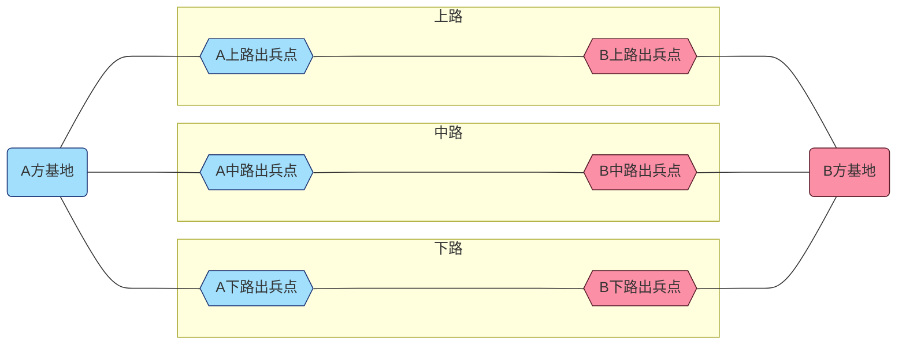

import Tabs from '@theme/Tabs';
import TabItem from '@theme/TabItem';

# 基本设计

## 对局

在游戏中进行的单次比赛称为对局。每次对局由两方参与，双方从相同或近似的初始状态开始，以一方的失败作为结束。  
对局之间互不影响，后面发生的对局不会继承前面对局的结果。

:::info[示例]
对局中，若双方选择了同样的文明进行对局，则对局开始时，双方应当处于完全一致的数值水平。
:::

## 战场

对局开展的场景称为战场。
  

## 玩家

对局的参与者被称为玩家，玩家是对局内所有决策、交互的操作者。

## 单位

战场中可存在、可被销毁、且具有一定主动或被动行为逻辑的物体被称为单位。

:::info[示例]
战场上玩家派出的士兵、建造的建筑都属于单位。
:::

## HP

*Hit Points*。用于指示单位在被销毁前还能承受的损失。俗称**血量、体力值、生命值**。  
当单位HP小于等于0时，单位将被摧毁。

## 基地

对局中玩家储备人力、物资，调遣单位，进而推动各式攻守策略的区块。

同时，基地也作为一个单位，用于指示玩家的损失情况。当基地HP小于等于0时，基地将被摧毁，即该方玩家失败。

## 路

战场上不同的进攻路线称为路。路的两端分别是两方玩家的基地，根据方位不同被分为**上路、中路和下路**。  
对于一方的单位而言，路的起点是该路的本方出兵点，终点是对方基地。

**三条路仅仅在基地处相连接，但对双方单位而言仅终点互通**

:::warning[注意]
所谓“**对双方单位而言仅终点互通**”，意思是对于某一方单位而言，其只能由出兵点向前，而无法后退绕道至其他路行进，因此当且仅当他们行进至终点时，他们才能相遇。
:::

## 调遣

将单位指派到战场中某个特定点位或区域上（譬如路）的过程称为调遣。调遣后的单位可称为**场上的单位**。

## 游戏目标

双方玩家在保证本方基地HP大于0的前提下，将对方基地的HP削减至0。

## 游戏流程

玩家需要采集资源，并利用手头上的资源进行购买单位、升级科技、购买建筑等一系列决策行为，最终击败对手。

## 游戏背景

游戏以玩具为表现形式。

游戏的文案设计基本遵循公元9世纪~16世纪的历史。

***

