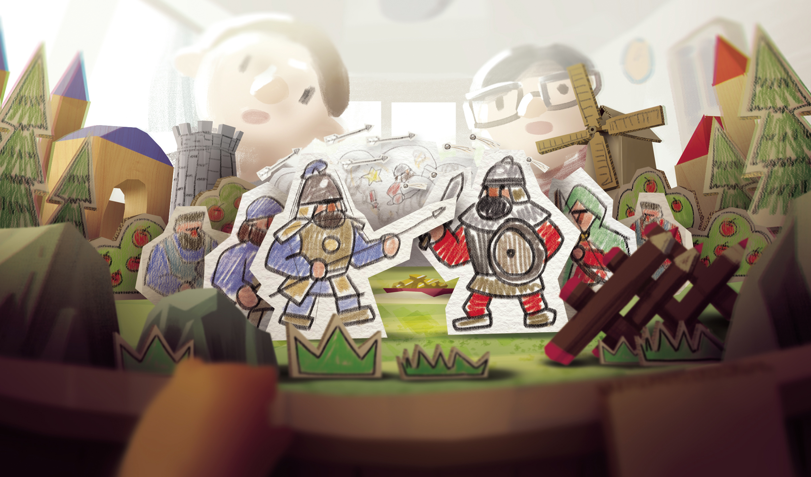

  
《玩具帝国》是一款独具特色的快节奏、无微操即时战略游戏，你要做的只有最纯粹的决策和博弈！
在近世历史的世界中选择一个喜欢的势力，是让大明天下无敌，还是法兰西横扫欧陆，又或是改写历史，让拜占庭复兴罗马？在玩具与纸片构成的战场上，一切皆有可能。
如何分配工人？颁布什么政策？是先军政策还是发展经济，是防守反击还是大兵压境？这些都是问题。——但无所谓，因为没有唯一的解法，见招拆招才能成为百战百胜！

在《玩具帝国》中你可以：

- 在多张生动漂亮的玩具纸模场景中进行即时战斗，每张地图都具有独特的玩法机制。
- 使用多个来自13世纪到18世纪的史实势力进行战斗，包括大明帝国、法兰西王国、拜占庭帝国等。
- 使用各个势力的史实兵种进行战斗，每个兵种都具有独特的特色。
- 在丰富的科技树上发展科技，解锁各种各样的新技术强化你的势力。
- 建造多种各具特色的建筑帮助你战胜敌人。
- 颁布各种史实政策引导你的子民。
- 与朋友们进行跨平台战斗。

:::note[官方QQ群]
965454724
:::